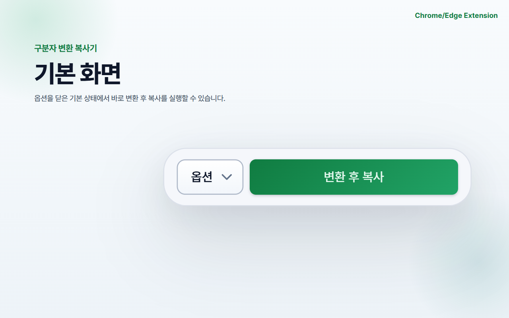
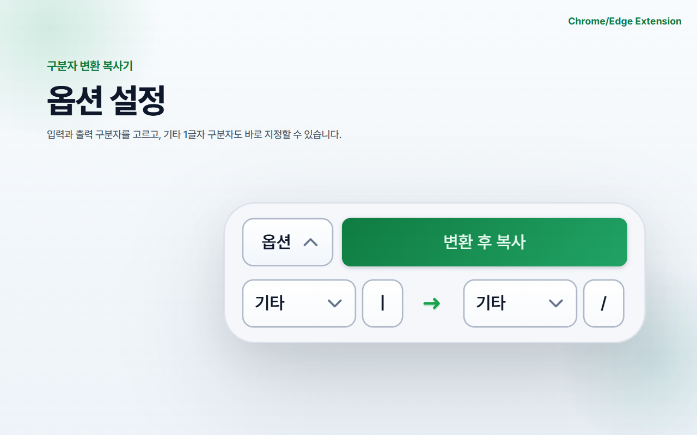
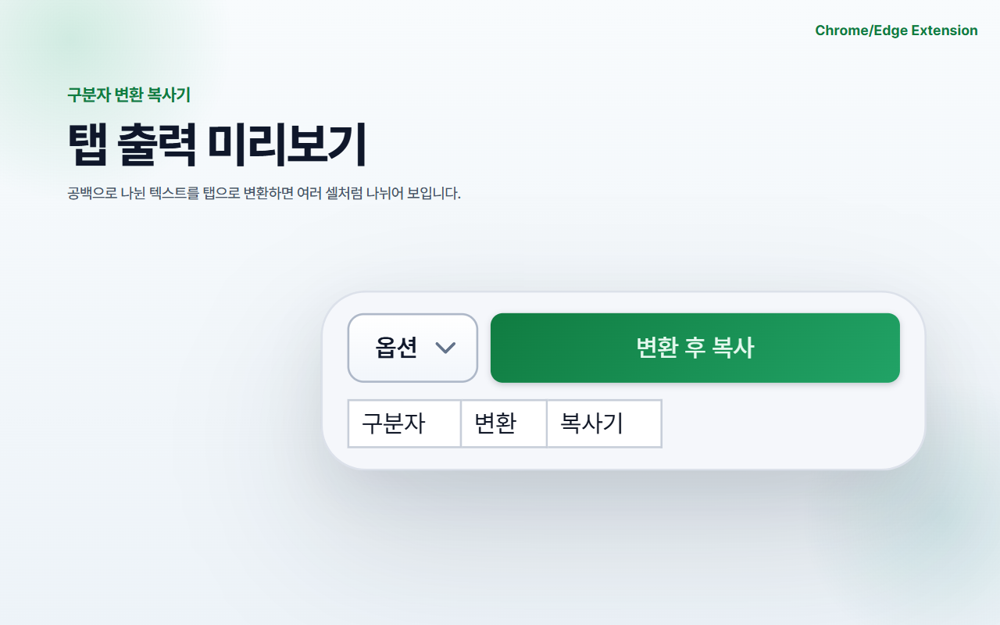
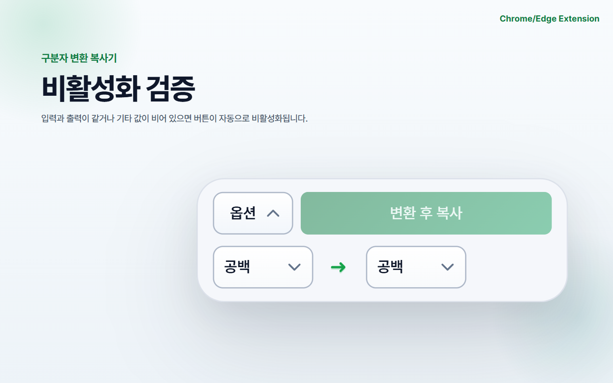

# 구분자 변환 복사기 (Delimiter Copy Converter)

클립보드 텍스트의 구분자를 빠르게 변환하고 다시 복사하는 Chrome/Edge 확장 프로그램입니다.

## 주요 기능
- 입력/출력 구분자 변환
  - 입력: 탭, 세미콜론, 공백, 콤마, 기타(1자)
  - 출력: 탭, 세미콜론, 공백, 콤마, 제거, 기타(1자)
- `기타` 입력은 1글자만 허용
- 입력/출력 구분자가 같으면 변환 버튼 비활성화
- `기타`가 비어 있으면 변환 버튼 비활성화
- 옵션값(입력/출력 구분자, 기타 값) 로컬 저장/복원
- 결과 미리보기 규칙
  - 출력이 `탭`일 때: 다중 셀 표시
  - 그 외 출력: 단일 셀 표시

## 프로젝트 구조
- `manifest.json`: 확장 프로그램 메타데이터/권한
- `popup.html`: 팝업 UI
- `popup.js`: 변환 로직/상태 관리
- `fonts/`: 로컬 Pretendard 폰트 번들
- `icons/`: 확장 아이콘
- `screenshots/store/`: 스토어 이미지 산출물
- `dist/`: 배포 ZIP 산출물
- `STORE_SUBMISSION.md`: 제출 체크리스트
- `STORE_LISTING_COPY.md`: 스토어 입력 텍스트
- `PRIVACY_POLICY.md`: 개인정보처리방침 원문

## 로컬 실행 (개발자 모드)
### Chrome
1. `chrome://extensions` 접속
2. 개발자 모드 활성화
3. "압축해제된 확장 프로그램을 로드" 클릭
4. 이 폴더(`Delimiter Copy Converter`) 선택

### Edge
1. `edge://extensions` 접속
2. 개발자 모드 활성화
3. "압축해제된 확장 프로그램 로드" 클릭
4. 이 폴더(`Delimiter Copy Converter`) 선택

## 배포 ZIP 생성
프로젝트 루트에서:

```powershell
if (Test-Path "dist/delimiter-copy-converter-v1.0.1.zip") {
  Remove-Item "dist/delimiter-copy-converter-v1.0.1.zip"
}

Compress-Archive -Path `
  manifest.json, popup.html, popup.js, icons, fonts `
  -DestinationPath dist/delimiter-copy-converter-v1.0.1.zip `
  -CompressionLevel Optimal
```

## 스토어 이미지 촬영 목록
이미지 규격은 `1280x800` 권장(Chrome/Edge 공통 사용 가능).

1. `01-main-default.png`
기본 화면. 옵션 닫힘 + `변환 후 복사` 버튼 노출 상태.

2. `02-options-open.png`
옵션 펼침 화면. 입력/출력 select, 화살표, 기타 입력칸 동작 구역 표시.

3. `03-usecase-tab-cells.png`
핵심 사용례(탭 출력). 예시 텍스트 `구분자 변환 복사기`를 구분자로 분리해 다중 셀로 보이는 장면.

4. `04-usecase-remove-single.png`
핵심 사용례(제거 출력). 예시 텍스트 `구분자 변환 복사기`를 제거 변환해 단일 셀로 보이는 장면.

5. `05-disabled-state.png`
검증 상태. 입력/출력 동일 또는 기타 미입력 시 버튼 비활성화 장면.

## 스크린샷 미리보기

<table>
  <tr>
    <td width="50%"></td>
    <td width="50%"></td>
  </tr>
  <tr>
    <td align="center"><strong>기본 화면</strong></td>
    <td align="center"><strong>옵션 설정</strong></td>
  </tr>
  <tr>
    <td width="50%"></td>
    <td width="50%"></td>
  </tr>
  <tr>
    <td align="center"><strong>탭 출력 미리보기</strong></td>
    <td align="center"><strong>제거 출력 미리보기</strong></td>
  </tr>
  <tr>
    <td width="50%"></td>
    <td width="50%"></td>
  </tr>
  <tr>
    <td align="center"><strong>비활성화 검증</strong></td>
    <td></td>
  </tr>
</table>

## 아이콘
- 현재 배포 아이콘은 `icons/icon16.png`, `icons/icon32.png`, `icons/icon48.png`, `icons/icon128.png`를 사용합니다.

## 스토어 제출 시 참고
- 업로드 파일: `dist/delimiter-copy-converter-v1.0.1.zip`
- 스토어 입력 문구: `STORE_LISTING_COPY.md`
- 제출 전 체크리스트: `STORE_SUBMISSION.md`
- 개인정보처리방침: `PRIVACY_POLICY.md` 내용을 웹에 게시한 URL 사용
